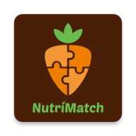
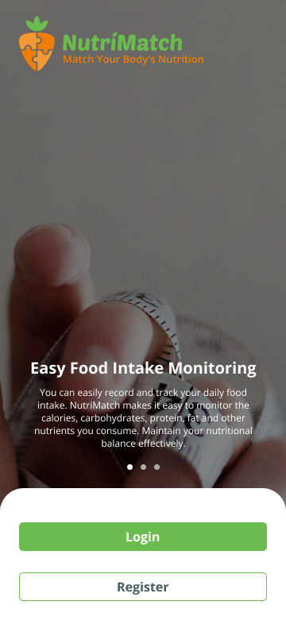
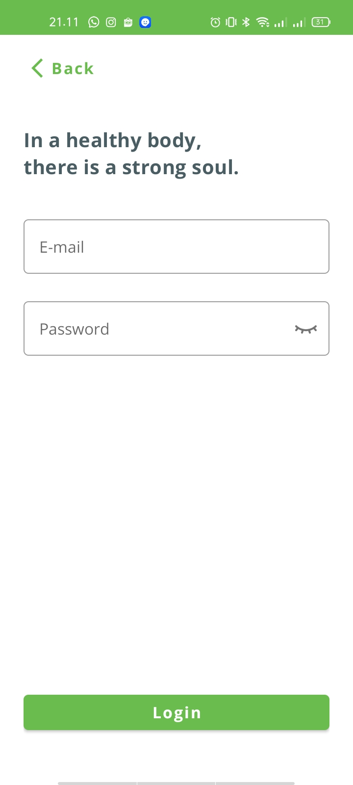
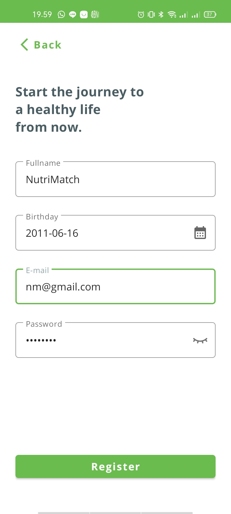
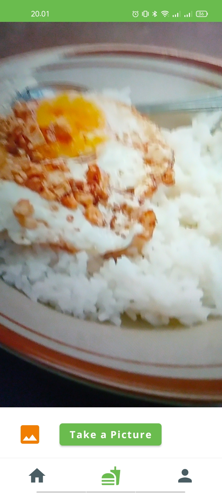

 

  

  <h3 align="center">NutriMatch, Match your body's nutrition</h3>

  

    NutriMatch is a mobile application developed with the purpose of helping users monitor and improve their daily food intake to maintain a balanced and healthy diet. The app provides a convenient and efficient way for users to track their nutritional intake and ensure they are meeting their daily requirements.
     
     
    <a href="https://github.com/NutriMatch/NutriMatch-MobileDev/releases/download/Release/NutriMatch1.0.0.apk">View Demo</a>
    ·
    <a href="https://github.com/NutriMatch/NutriMatch-MobileDev/issues">Report Bug</a>
    ·
    <a href="https://github.com/NutriMatch/NutriMatch-MobileDev/issues">Request Feature</a>
  

## Team C23-PR561 Contributors
* Eko Sura’ Kapuangan (M177DSX3504) – [GitHub@3kosurakapuangan](https://github.com/3kosurakapuangan) - Universitas Hasanuddin
* Rafi Indra Fattah (M151DSX0151) – [GitHub@RafiIndra](https://github.com/RafiIndra) - Universitas Brawijaya
* Arum Abrori (M151DSY0524) – [GitHub@auryhs](https://github.com/auryhs) - Universitas Brawijaya
* Jelita Firdaus Sakinah (C062DSY0688) – [GitHub@jelitaa6](https://github.com/jelitaa6) - Politeknik Negeri Jakarta
* Inesya Adella (C062DSY2598) – [GitHub@inesyaaa](https://github.com/inesyaaa) - Politeknik Negeri Jakarta
* Akmal Muhamad Firdaus (A360DKX4024) – [GitHub@CoderNewbie04](https://github.com/codernewbie04) - Telkom University

## Wireframe & Mock-Up
[Figma](https://www.figma.com/file/JCITEurXjyjjBVRHY4jZNC/Product-Capstone?type=design&node-id=21%3A358&t=A3iQMlIn0eL4nPX1-1)

## REST API Documentation
[Postman](https://www.postman.com/cryosat-operator-82095093/workspace/bangkit/documentation/18794220-ce59b8f5-7031-49c8-8b59-9ecd747a3df5)

## Preview

  
  
  
  

### Key Features
* Calorie Tracking: NutriMatch enables you to track your daily calorie intake effortlessly. Stay on top of your nutritional goals by monitoring the number of calories consumed throughout the day.
* Food Database: Access a comprehensive database of various food items with accurate nutritional information. Easily search for and log the foods you consume, making it convenient to monitor your intake accurately.
* Progress Tracking: Keep tabs on your progress and visualize your nutritional journey over time. NutriMatch provides intuitive graphs and charts to track your food intake patterns and make informed adjustments.
* User-Friendly Interface: NutriMatch features a sleek and intuitive interface, making it easy to navigate and use the app efficiently. Enjoy a seamless user experience while managing your nutritional well-being.

## Technology
* Kotlin
* Clean Architecture
* Dagger-Hilt
* Retrofit2
* Camera2
